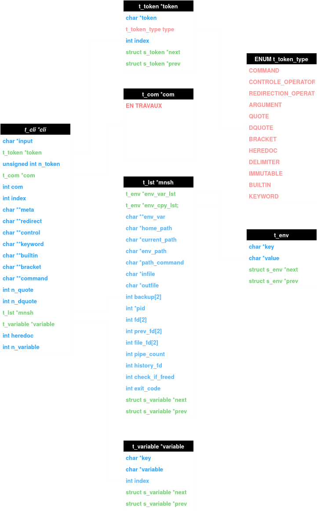

# MINISHELL

As beautiful as a shell..

## TO_FIX
- heredoc with pipes (looping indefinitely)
- Need to do the redirections of output and input
- Simple quotes and double quotes
- Echo built-ins might need to change to accomodate parsing
- Parsing to get better input and output
- Exit code of commands
- Right exit error message (instead of perror)
- Env built-in parsing

## TO_DO

For execve :
    - need a have the path of the command
    - need to have the command with his mnsh
exemple : cat Makefile
    /usr/bin/cat (check_path function)
    cat Makefile

- Commande du demon : ls | echo $PATH | cat
- Fix des pipes avec le heredoc, exemple de fail : << ls | cat
- heredoc avec commands derriere, exemple : << ls cat (copy the output into a file and use it instead of an infile)
- toutes les redirections de merdes du style : 
    - <infile commands > outfile
    - <<del commands > outfile
    - <<del commands
    - >commands > outfile

- Heredoc problem not considered as command
- the path of the next command in pipe does not exist
- ./minishell in minishell does not work anymore
- bash lt tous les infiles outfiles

## Diagram

</img>

## Links 

- https://www.gnu.org/software/bash/manual/html_node/Builtin-Index.html
- https://www.gnu.org/software/bash/manual/bash.html
- https://www.linux.org/threads/bash-01-script-basics.37797/#post-143818
- https://www.linux.org/threads/bash-02-%E2%80%93-variables-and-such.38200/
- https://www.linux.org/threads/bash-03-%E2%80%93-command-line-processing.38676/
- https://se.ifmo.ru/~ad/Documentation/Bash_Shell/bash3-CHP-7-SECT-3.html